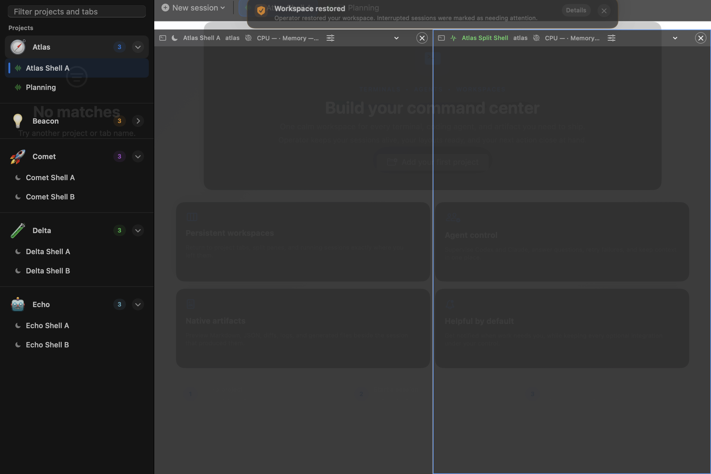

# Operator

<p align="center">
  <strong>The control room for AI-assisted development on macOS.</strong><br>
  Run your coding agents, shells, and project workspaces side by side—with the context and control to keep work moving.
</p>

<p align="center">
  <a href="https://github.com/brcosta/operator-app/actions/workflows/ci.yml"></a>
  
  
</p>

Operator is a native, local-first macOS workspace for interactive CLI harnesses such as Codex CLI, Claude Code, and any shell command. It turns a collection of terminal windows into a project-aware command center: launch work where it belongs, see what changed, answer questions when they matter, and resume the right context later.

No hosted service. No prompt ingestion. No opaque automation. Operator keeps the human in control.

## See it in action

One Operator window can hold multiple projects, live sessions, and split panes while keeping the active work easy to find.



## The problem Operator solves

AI-assisted development gets messy as soon as several tasks run at once. Context is split across terminal windows, repositories, worktrees, agent sessions, and unread notifications. Operator gives that work a durable home:

```text
Project
├── service repositories and Git worktrees
├── Codex, Claude Code, and shell sessions
├── split panes, layouts, and task briefs
└── activity, questions, artifacts, and Git visibility
```

## Why developers use it

### Keep every task in context

Projects are task containers, not just folders. Add the repositories and worktrees that belong together, give the project a recognizable identity, and open an independent grid of sessions without losing your place.

- Launch Codex CLI, Claude Code, a shell, or a custom command from one palette.
- Split, arrange, and zoom panes without opening another app window.
- Name tabs for the work they represent, not just the process that launched them.
- Keep each project’s tabs and layout independent when switching projects.

### Supervise agents without hovering

Operator makes asynchronous work legible. Add a persistent **Task Brief** with the objective, constraints, and acceptance criteria. The **Activity** panel records launches, brief updates, file changes, and outcomes. Questions route back to the project and pane that raised them.

The native menu bar control center summarizes running harnesses, unanswered questions, and new-session actions. Optional notifications, Dock badges, and progress rings help you stay informed without keeping every terminal visible.

Harnesses can publish structured events and artifacts:

```sh
operator event progress "Indexing repository"
operator event child-started "review-agent"
operator artifact open reports/results.json json
operator question "Which migration should I use?"
```

### Review changes while work is running

Operator gives every Git-backed workspace a read-only view of what is happening:

- Branch, upstream ahead/behind state, latest commit, and staged/unstaged/untracked counts.
- A live changed-file radar in the session status bar.
- Native unified or side-by-side diffs that refresh as the worktree changes.
- Rendered Markdown tabs for plans, reports, and generated documentation.

It is visibility without accidental mutation: Operator does not stage, discard, commit, push, or run network Git operations.

### Resume intentionally

Session recipes and layouts are stored per project. Claude Code and Codex sessions can retain their managed identity so the right conversation comes back with the right workspace. Interactive shells are restored safely; arbitrary generic commands are never rerun automatically.

When a session is unavailable, Operator collapses stale panes instead of presenting a convincing-looking empty tab. You get continuity without surprise execution.

### Stay local and human-controlled

Operator stores project, profile, layout, and session-status metadata—but never terminal scrollback or prompts. Diagnostics are structured, bounded, and redacted. Credential-like environment values, tokens, passwords, API keys, cookies, and credential-bearing URLs are not persisted.

## A quick start

### Requirements

- macOS 14 or later
- Xcode 16+ or another Swift 6-compatible toolchain

### Build the release app

```sh
./Scripts/package-app.sh
open dist/Operator.app
```

Then:

1. Add a project and its working directories from the sidebar.
2. Press **Command-K** to launch Codex, Claude Code, a shell, or a custom command.
3. Open a second session and use **Split** to compare work side by side.

This creates `dist/Operator.app` and refuses to overwrite an existing bundle. The app is currently unsigned and unnotarized; macOS Gatekeeper may require manual approval.

## Built for the agent workflow

### Open generated work as a document

Every Operator terminal receives an `operator` helper command. Open Markdown produced by a harness in a rendered tab, with the source still available:

```sh
operator open docs/implementation-plan.md
```

Relative paths resolve from the terminal’s current directory. `.md`, `.markdown`, and `.mdx` files refresh when they change.

### Inspect a repository without leaving the workspace

```sh
operator diff
operator diff path/to/project
```

The native Changes tab groups staged, unstaged, and untracked files and supports unified or side-by-side diffs.

### Let a harness shape its own workspace

```sh
operator split-right
operator split-down
```

The request is scoped to the terminal that issued it, even if another pane currently has UI focus.

## Native Mac, not a browser shell

Operator uses SwiftUI and native macOS integrations for the parts that should feel immediate:

- Native terminal panes powered by SwiftTerm.
- Material surfaces, semantic project and harness colors, and compact status bars.
- Customizable monospaced font, size, ligatures, scrollback, appearance, and pane layout.
- FSEvents-based Git file watching with a debounced fallback.
- macOS window tabbing, menu bar control center, Dock status, keyboard shortcuts, and accessibility-aware reduced motion.

## Trust boundaries

Operator is deliberately conservative about what it does on your behalf:

- **Local-first:** project state and diagnostics stay on the Mac.
- **Read-only Git insight:** inspect changes and health without exposing destructive Git actions in the UI.
- **Explicit notifications:** alerts start disabled and are enabled only from Activity for the current run.
- **Safe restoration:** validated shells and managed harness sessions may resume; one-shot commands do not.
- **Redacted diagnostics:** logs never retain terminal contents, prompts, environment values, or session tokens.

See [SECURITY.md](SECURITY.md) for the trust model, multi-machine guidance, and remaining risks.

## Verify the project

```sh
swift format lint Package.swift
swift format lint -r Sources Tests UITests
swift test
./Scripts/package-app.sh /private/tmp/Operator.app
./Scripts/smoke-test-app.sh /private/tmp/Operator.app
```

The smoke harness launches the exact packaged bundle with isolated state, verifies the executable and release identity, checks the root view, exercises state persistence, and writes a machine-readable report without touching your normal Operator workspace.

The repository also includes native XCUITests and a multi-project UI stress test. CI builds in release mode, enforces formatting, runs the Swift test suite, packages the app, and validates the resulting bundle. Tagged builds produce an experimental unsigned DMG and checksum.

## Versioning

Operator follows [Semantic Versioning](https://semver.org/). `0.2.0` is the current public baseline while APIs and workflows continue to evolve. `Config/Version.xcconfig` is the release-version source of truth; releases should receive a matching `vX.Y.Z` tag and an entry in [CHANGELOG.md](CHANGELOG.md).

## License and third-party code

Operator includes SwiftTerm under the terms described in [THIRD_PARTY_NOTICES.md](THIRD_PARTY_NOTICES.md).
